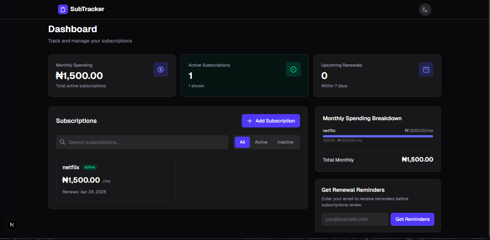

# SubTracker

SubTracker is a modern subscription management dashboard built with Next.js, React, TypeScript, and Tailwind CSS.
It helps users track recurring subscriptions, monitor monthly spending, and stay ahead of renewal dates.

## Project Preview



## Features

- Add, edit, and delete subscriptions
- Track monthly and yearly plans with automatic monthly equivalent calculations
- Filter subscriptions by status (`all`, `active`, `inactive`)
- Search subscriptions by name
- Dashboard summary cards for monthly spending, active count, and upcoming renewals (next 7 days)
- Spending breakdown visualization by subscription
- Pricing section with multiple plan options and product-inspired pricing cards
- Light and dark theme toggle with saved preference
- Local persistence using browser `localStorage` (no backend required)

## Tech Stack

- Next.js `16.2.4` (App Router)
- React `19.2.4`
- TypeScript
- Tailwind CSS `v4`
- ESLint (Next.js + TypeScript config)

## Project Structure

```text
subtracker/
|- app/          # App shell, page, providers, global styles
|- components/   # UI building blocks and dashboard widgets
|- context/      # Subscription state management (React Context)
|- lib/          # Storage and utility helpers
|- types/        # Shared TypeScript domain models
`- public/       # Static assets
```

## Getting Started

### Prerequisites

- Node.js 20+ recommended
- npm (comes with Node.js)

### Installation

```bash
npm install
```

### Run Development Server

```bash
npm run dev
```

Open [http://localhost:3000](http://localhost:3000) in your browser.

## Available Scripts

- `npm run dev` - start local development server
- `npm run build` - create production build
- `npm run start` - run production server
- `npm run lint` - run lint checks

## Data and State Flow

- Global app state is managed in `context/SubscriptionContext.tsx`.
- Browser `localStorage` keys:
- `subtracker_subscriptions` for subscription records
- `subtracker_reminder_email` for reminder email preference
- `subtracker_theme` for theme preference

Because storage is client-side only, data is device/browser specific and not synced across devices.

## Current Scope and Limitations

- No backend/API integration yet
- No authentication or multi-user support
- No automated reminder delivery service (email is currently stored locally for future integration)
- No test suite is configured yet

## Future Improvements

- Backend persistence and user accounts
- Real email/SMS reminder scheduling
- Budget alerts and spending trends over time
- Export/import subscription data
- Automated tests (unit + integration)

## License

This project is currently unlicensed. Add a `LICENSE` file if you plan to distribute it publicly.
